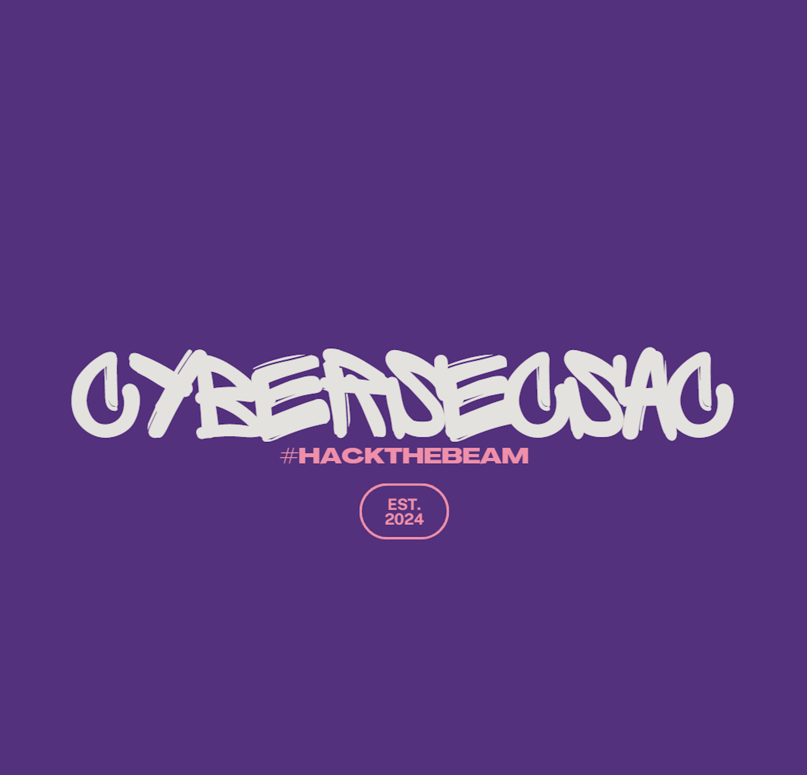

---

# [Join Our Discord](https://discord.gg/9YeYME9tWa)

---

# About
A group in the greater Sacramento County area for hackers, makers, tinkerers and security enthusiasts/professionals to meet and share projects/ideas. Current leader is [RadicalKjax](https://twitter.com/radicalkjax).

# Location
Sacramento, California
United States

---

# [Meeting Minutes in Discord](https://discord.gg/BKJPgvz5kE)

# Meeting Schedule
Second Wednesday of the month from 7PM - 8:30PM. Virtual meetings during August (hacker summer camp) and during November/December for the holidays.

# Current Meeting Time & Place:
Virtually on Discord, September 11th from 7PM - 8:30PM.
Physcial Location TBD. Please reach out to [RadicalKjax](https://twitter.com/radicalkjax) or any one of the CyberSecSac social links if you know of any availiable space.

---

# Socials
* [Twitter](https://twitter.com/CyberSec916)
* [Instagram](https://instagram.com/cybersec916)
* [Facebook](https://facebook.com/profile.php?id=61559952651821)
* [Threads](https://www.threads.net/@cybersec916)

---

# Areas of Interest
* Lock-picking
* Red-teaming
* ICS
* AgHacking
* Policy/Gov hacking

# Current Projects
* Badge and Hardware hacking
* CTFs
* Reverse Engineering

---

 Designed with love by Kali <3
